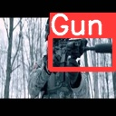

<h3 align="left">Description:</h3>

Images folder has images in <code>jpeg</code> format. Labels folder has <code>txt</code> files where in each file, the first line contains the number of objects in the corresponding image and the next lines contain the co-ordinates of the box describing the object.

- 💬 What new in this project **In this project i have used yolov5 to detect gun in an image. the dataset is taken from kaggle and the images resolution was irregular. I have used python library "Chitra" to resize all the images with their bounding box and applied the yolov5 model. The model achieved better MAP score**

<h3 align="left">Languages and Tools:</h3>

      

<h3 align="left">Predictions:</h3>

  
  

